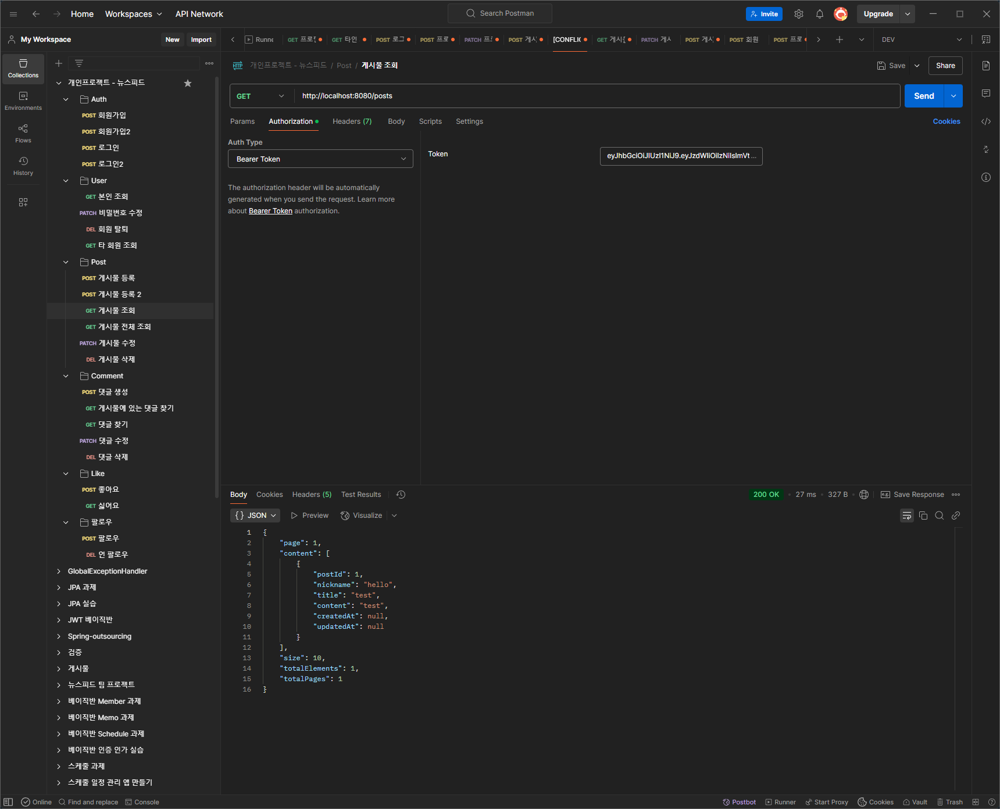

### 1. ERD

### 2. 테스트 커버리지 50% 달성

### 3. API 명세서

### 4. POSTMAN 실행사진
#### 1. 회원가입

#### 2. 로그인

#### 3. 본인 조회

#### 4. 비밀번호 수정

#### 5. 회원 탈퇴

#### 6. 타 회원 조회 (생성일 NULL이 나오는 이유는 테스트코드에서 JPAAUDITING을 따로 빼서 그렇습니다.)

#### 7. 게시물 등록

#### 8. 게시물 조회

#### 9. 게시물 수정

#### 10. 게시물 삭제

#### 11. 댓글 등록

#### 12. 게시글에 있는 댓글 조회

#### 13. 댓글 조회

#### 14. 댓글 수정

#### 15. 댓글 삭제

#### 16. 팔로우

#### 17. 언팔로우

#### 18. 좋아요

#### 19. 좋아요 취소
